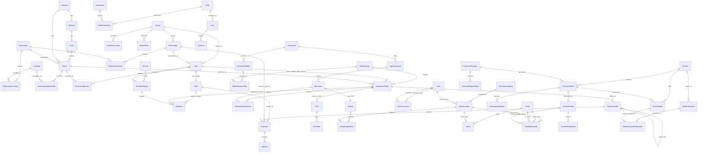

# RESORT & RESTAURANT MANAGEMENT SYSTEM — ENTITY RELATIONSHIP DIAGRAM (ERD)

**System:** The Royal Reserve Resort Management System  
**Phase:** 0.2 Domain Model ERD  

```mermaid
erDiagram
    %% PMS & ROOM INVENTORY
    Property ||--o{ Building : "has"
    Building ||--o{ Floor : "has"
    Floor ||--o{ Room : "contains"
    Property ||--o{ Room : "owns"
    RoomType ||--o{ Room : "categorizes"
    RoomType ||--o{ RoomTypeAmenity : "defines"
    Amenity ||--o{ RoomTypeAmenity : "included_in"
    Room ||--o{ RoomAmenityOverride : "overrides"
    Amenity ||--o{ RoomAmenityOverride : "overridden_by"

    %% RESERVATION & PMS LIFECYCLE
    Guest ||--o{ Reservation : "books"
    Guest ||--o{ GuestDocument : "provides"
    Guest ||--o{ GuestPhoto : "captured"
    Guest ||--o{ Stay : "checks_in"
    Reservation ||--o{ ReservationRoom : "reserves"
    RoomType ||--o{ ReservationRoom : "inventory_of"
    Reservation ||--o{ Stay : "materializes_as"
    Stay ||--o{ RoomAssignment : "assigns"
    Room ||--o{ RoomAssignment : "occupied_by"

    %% FOLIO & FINANCIAL TRANSACTIONS
    Stay ||--|| Folio : "has_ledger"
    Folio ||--o{ FolioItem : "tracks_charges"
    Folio ||--o{ Payment : "settled_by"
    Reservation ||--o{ Payment : "advance_paid_by"
    Payment ||--o{ Refund : "reverses"

    %% RESTAURANT POS & KOT
    Restaurant ||--o{ RestaurantTable : "contains"
    Restaurant ||--o{ MenuCategory : "offers"
    MenuCategory ||--o{ MenuItem : "contains"
    RestaurantTable ||--o{ TableSessionTable : "grouped_in"
    TableSession ||--o{ TableSessionTable : "joins"
    TableSession ||--o{ RestaurantOrder : "initiates"
    Stay ||--o{ RestaurantOrder : "orders_room_service"
    Room ||--o{ RestaurantOrder : "delivered_to"
    RestaurantOrder ||--o{ RestaurantOrderItem : "contains"
    MenuItem ||--o{ RestaurantOrderItem : "ordered"
    RestaurantOrder ||--o{ KOT : "kitchen_tickets"
    KOT ||--o{ KOTItem : "items"
    RestaurantOrder ||--o{ RestaurantBill : "billed_as"
    RestaurantBill ||--o{ RestaurantBill : "splits_into"
    RestaurantBill ||--o{ Payment : "paid_by"
    RestaurantOrder ||--o{ FolioItem : "charged_to_room"

    %% RECIPES & INVENTORY
    MenuItem ||--o| Recipe : "has_BOM"
    Recipe ||--o{ RecipeIngredient : "requires"
    InventoryItem ||--o{ RecipeIngredient : "supplies"
    InventoryCategory ||--o{ InventoryItem : "categorizes"
    Unit ||--o{ InventoryItem : "measured_in"
    Unit ||--o{ UnitConversion : "converts_from"
    Unit ||--o{ UnitConversion : "converts_to"
    Store ||--o{ Stock : "holds"
    InventoryItem ||--o{ Stock : "stock_level"
    InventoryItem ||--o{ StockMovement : "transacted_in"
    Store ||--o{ StockMovement : "from_store"
    Store ||--o{ StockMovement : "to_store"

    %% PROCUREMENT & VENDORS
    Vendor ||--o{ PurchaseOrder : "receives"
    PurchaseRequest ||--o{ PurchaseRequestItem : "requests"
    PurchaseRequest ||--o{ PurchaseOrder : "generates"
    PurchaseOrder ||--o{ PurchaseOrderItem : "specifies"
    PurchaseOrder ||--o{ GoodsReceipt : "delivered_as"
    GoodsReceipt ||--o{ GoodsReceiptItem : "checks"
    GoodsReceipt ||--o{ StockMovement : "creates_ledger_entry"
    Vendor ||--o{ PurchaseBill : "bills"
    PurchaseOrder ||--o{ PurchaseBill : "invoiced_for"
    Vendor ||--o{ VendorPayment : "paid_via"
    VendorPayment ||--o{ VendorPaymentAllocation : "allocates_to"
    PurchaseBill ||--o{ VendorPaymentAllocation : "receives_payment"

    %% SERVICES & RBAC
    Service ||--o{ ServiceRequest : "fulfills"
    Stay ||--o{ ServiceRequest : "requests"
    ServiceRequest ||--o{ FolioItem : "charges"
    Role ||--o{ RolePermission : "authorizes"
    Permission ||--o{ RolePermission : "permits"
    Role ||--o{ User : "assigned_to"
    User ||--o{ AuditLog : "initiates"
```