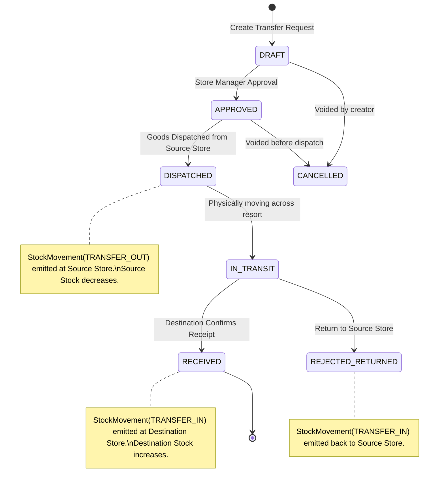

# PHASE 0.7 ARCHITECTURAL IMPLEMENTATION PLAN
## INVENTORY & STORES MANAGEMENT SUBSYSTEM
### Infinity Resort & Restaurant (Indore, Madhya Pradesh, India)

**Document Version:** 2.1.0 (Final Approved Architectural Baseline with Mandatory Implementation Constraints)  
**Baseline Commit:** `69dcd8e` (`feat(restaurant): implement phase 0.6 pos kot billing`)  
**Status:** PLAN-ONLY (APPROVED FOR IMPLEMENTATION)  
**Target Module:** `/admin/inventory` & Stores Ledger Subsystem  

---

## EXECUTIVE SUMMARY & MANDATORY IMPLEMENTATION CONSTRAINTS

This plan incorporates all 12 mandatory implementation constraints specified during final review to guarantee zero inventory/accounting drift:

1. **`InventoryConsumption` is strictly immutable**: Each serving event creates an uneditable snapshot capturing the exact `KOTItem`, portions consumed, recipe snapshot/version, ingredients consumed, and resulting `StockMovement` links. No update-in-place.
2. **Deterministic Sequence-Based Idempotency**: Idempotency keys do not rely on floating-point strings. Keys are constructed from `KOTItem.id + servedSequenceNumber` (or deterministic integer portion delta).
3. **Served-Delta Consumption**: Consumption is triggered strictly by the **served quantity delta** ($\Delta \text{served}$), never cumulative quantities.
4. **Recipe Version / BOM Snapshot Protection**: Ingredients, yield, and standard cost are snapshotted on the consumption record at execution time, guaranteeing that subsequent recipe edits never alter historical consumption records.
5. **Atomic Transactional Synchronization**: `SELECT ... FOR UPDATE` on `Stock` $\to$ Validate balance $\to$ Calculate `balanceAfter` $\to$ Insert `StockMovement` $\to$ Update `Stock.quantityOnHand` $\to$ Commit. No stock balance mutation without a corresponding ledger entry.
6. **Concurrency-Safe `balanceBefore` / `balanceAfter`**: Calculated strictly while holding the row-level exclusive lock on `Stock`.
7. **Atomic Negative Stock Rollback**: When `ALLOW_NEGATIVE_STOCK = false`, any deficit rolls back the entire transaction.
8. **Transfer Failure & Discrepancy Matrix**: Explicit state handling for `DISPATCHED` ($\to \text{TRANSFER\_OUT}$), `RECEIVED` ($\to \text{TRANSFER\_IN}$ for accepted; $\to \text{DAMAGE}$ for damaged), rejection, and short deliveries.
9. **Stock Count Interim Movement Reconciliation**:
   $$\text{Expected} = \text{snapshotQuantity} + \text{interimInbound} - \text{interimOutbound}$$
   $$\text{Variance} = \text{physicalCount} - \text{Expected}$$
   Posts exactly one compensating adjustment line.
10. **Moving Weighted Average Cost (WAC)**:
    $$\text{newWAC} = \frac{(\text{oldQty} \times \text{oldWAC}) + (\text{receivedQty} \times \text{receivedCost})}{\text{oldQty} + \text{receivedQty}}$$
    Outbound movements inherit current WAC; historical ledger rows are immutable.
11. **Total Isolation & Deletion of Defective Phase 0.6 Callers**: All callers/imports of `deductOrderRecipeStock()` removed from restaurant actions; runtime deprecation guard installed.
12. **Strong Ledger Assertions in Tests**: Concurrent KOT tests assert exact final movement counts, exact consumption event counts, and exact mathematical equality between `Stock.quantityOnHand` and ledger sums.

---

## 1. RESTAURANT CONSUMPTION: SERVED-DELTA ARCHITECTURE

### 1.1 Root Cause of Phase 0.6 Defect
In Phase 0.6 (`src/lib/restaurant/recipe-service.ts` and `src/actions/restaurant.ts`):
```typescript
// Defective Phase 0.6 trigger:
if (status === 'SERVED') {
  const kot = await prisma.kOT.findUnique({ where: { id: kotId }, select: { orderId: true } });
  if (kot?.orderId) {
    await deductOrderRecipeStock({ orderId: kot.orderId }); // BUG: Deducts ALL items in the entire order!
  }
}
```
If an order contains:
- 2 × Paneer Butter Masala (KOT-001)
- 1 × Naan (KOT-002)

When KOT-001 is served, Phase 0.6 deducted 2 Paneer + 1 Naan. When KOT-002 is served, Phase 0.6 deducted 2 Paneer + 1 Naan again! Result: 4 Paneer and 2 Naan consumed from inventory.

### 1.2 Phase 0.7 Corrected Invariant: Strict Downward Traversal
Inventory consumption must originate from the **served items of the specific KOT**, traversing:

$$\text{KOT} \longrightarrow \text{KOTItem} \longrightarrow \text{RestaurantOrderItem} \longrightarrow \text{MenuItem} \longrightarrow \text{Recipe} \longrightarrow \text{RecipeIngredient} \longrightarrow \text{InventoryItem} \longrightarrow \text{StockMovement}$$

Under this architecture:
- When **KOT-001** is served: Only the 2 × Paneer Butter Masala BOM ingredients are deducted.
- When **KOT-002** is served: Only the 1 × Naan BOM ingredients are deducted.
- Never inspect or deduct items from sibling KOTs.

---

## 2. QUANTITY LIFECYCLE: SERVED VS. CONSUMABLE INVENTORY

### 2.1 Quantity Definitions

| Quantity Term | Domain Context | Definition & Formula |
| :--- | :--- | :--- |
| **`orderedQuantity`** | `RestaurantOrderItem` | Total portions requested by guest on the bill/order. |
| **`firedQuantity`** | `KOTItem` | Portions dispatched to kitchen printers/KDS on a specific ticket. |
| **`preparedQuantity`** | Kitchen Station | Portions physically cooked by chefs. |
| **`servedQuantity`** | Table Delivery | Portions delivered to the guest table ($\text{servedQuantity} \le \text{firedQuantity}$). |
| **`cancelledQuantity`** | Cancellation | Portions voided after KOT dispatch ($\text{cancelledQuantity} = \text{firedQuantity} - \text{servedQuantity}$). |
| **`consumableQuantity`**| Inventory Subsystem | The exact portion count that consumes raw ingredients from stock. |

### 2.2 Operational Cancellation Rules & Inventory Effects

1. **Cancellation Before Cooking (Raw Ingredients Intact)**:
   - Example: 6 × Naan fired. 3 served to table. 3 cancelled before dough was rolled.
   - **`consumableQuantity` = 3**.
   - Inventory deduction: $3 \times \text{Recipe Ingredient Quantities}$.
   - The 3 cancelled naans emit **zero** stock movement (ingredients remain in stock).
2. **Cancellation After Cooking (Kitchen Waste / Food Spoiled)**:
   - Example: 2 × Biryani prepared, but guest left or order was wrong.
   - **`consumableQuantity` = 2**.
   - System posts:
     - $2 \times \text{BOM}$ as `StockMovement(STOCK_ISSUE)` for the KOT preparation.
     - Follow-up action allows Kitchen Supervisor to log $2 \times \text{BOM}$ under `StockMovement(WASTAGE)` with reason: "Prepared food rejected / guest walkout".

---

## 3. IMMUTABLE CONSUMPTION LEDGER & SERVED-DELTA IDEMPOTENCY

### 3.1 Constraint: Immutable Event Model with Served Deltas
- `InventoryConsumption` is an **immutable, append-only event record**.
- Consumption operates strictly on the **served delta** ($\Delta \text{served} = \text{newServedTotal} - \text{previousServedTotal}$), not cumulative totals.

Example Workflow:
```text
Ordered: 6 Naan
Fired:   6 Naan
Event 1: 2 Naan served -> delta = 2 -> InventoryConsumption #1 (portions: 2, seq: 1)
Event 2: 1 Naan cancelled
Event 3: 3 Naan served (total served now 5) -> delta = 3 -> InventoryConsumption #2 (portions: 3, seq: 2)
Total consumed = 2 + 3 = 5 portions.
```

### 3.2 Schema Definition: `InventoryConsumption`
```prisma
model InventoryConsumption {
  id               String          @id @default(cuid())
  kotItemId        String
  kotItem          KOTItem         @relation(fields: [kotItemId], references: [id], onDelete: Restrict)
  
  // Integer sequence number per KOTItem: 1, 2, 3...
  sequenceNumber   Int             @default(1)
  
  // Portion delta consumed in this specific event
  portionsDelta    Int
  
  // Deterministic Idempotency Key
  idempotencyKey   String          @unique // "CONSUME_<kotItemId>_SEQ_<sequenceNumber>"
  
  // Recipe Snapshot at consumption moment
  recipeId         String
  recipeYield      Int
  bomSnapshot      Json            // Array of { inventoryItemId, unitId, quantityPerYield, unitCost }
  
  movements        StockMovement[]
  
  createdAt        DateTime        @default(now())

  @@unique([kotItemId, sequenceNumber])
  @@index([kotItemId])
}
```

---

## 4. STOCK QUANTITY CACHING & CONCURRENCY-SAFE LEDGER UPDATES

### 4.1 Single Authoritative Cache: `Stock.quantityOnHand`
- `StockMovement` is the **single authoritative ledger of truth**.
- `Stock.quantityOnHand` is the **sole transactional cache**, scoped strictly to `[storeId, itemId]`.
- `InventoryItem.currentStockTotal` is **deprecated** and will not be locked or relied upon during operational POS/Store actions, avoiding cross-store row lock contention.

### 4.2 Row-Locking & Ledger Mutation Pattern
Every inventory alteration must execute inside an interactive PostgreSQL transaction with row locks:

```text
BEGIN
  1. SELECT id, "quantityOnHand" FROM "Stock" 
     WHERE "storeId" = :storeId AND "itemId" = :itemId 
     FOR UPDATE;
     
  2. Validate balance:
     if (isOutbound && !ALLOW_NEGATIVE_STOCK && quantityOnHand < deltaQty) {
       ROLLBACK; // Throw InsufficientStockError
     }
     
  3. Calculate running balance snapshots while holding lock:
     balanceBefore = quantityOnHand;
     balanceAfter  = isOutbound ? (balanceBefore - deltaQty) : (balanceBefore + deltaQty);
     
  4. INSERT INTO "StockMovement" (
       movementNumber, storeId, itemId, movementType, quantity,
       balanceBefore, balanceAfter, unitCost, totalCost, ...
     );
     
  5. UPDATE "Stock" SET "quantityOnHand" = balanceAfter WHERE id = :stockId;
COMMIT
```

---

## 5. PHYSICAL STOCK TRANSFER LIFECYCLE (MODEL A)

### 5.1 Transfer State Machine & Ledger Events



### 5.2 Discrepancy & Failure Handling Matrix

| Scenario | System Handling | Ledger & Stock Actions |
| :--- | :--- | :--- |
| **Clean Receipt** | Destination accepts 100% of dispatched quantity. | `TRANSFER_IN` posted for full dispatched quantity at destination store. |
| **Short Receipt** | Dispatched 10, Destination physically receives 8. 2 missing. | `TRANSFER_IN` posted for 8. `WASTAGE` / `DISCREPANCY` movement posted for 2 against transit handling. |
| **Damaged Delivery** | Dispatched 10, 8 in good condition, 2 broken in transit. | `TRANSFER_IN` posted for 8 to destination stock. `DAMAGE` movement posted for 2 to scrap/transit account. |
| **Full Rejection** | Destination store manager rejects entire batch (wrong spec). | Transfer marked `REJECTED_RETURNED`. Compensating `TRANSFER_IN` posted back to source store. |
| **Cancellation Post-Dispatch** | Forbidden by state machine. | Once in `IN_TRANSIT`, transfer must be received or formally rejected/returned. |

---

## 6. STOCK COUNT INTERIM MOVEMENT RECONCILIATION

### 6.1 Formula
At audit posting time:
$$\text{Expected Stock} = \text{snapshotQuantity} + \text{Interim Inbound} - \text{Interim Outbound}$$
$$\text{Variance} = \text{physicalCount} - \text{Expected Stock}$$

### 6.2 Ledger Execution
- If $\text{Variance} > 0 \implies$ System posts exactly one `StockMovement(ADJUSTMENT_IN)` for $|\text{Variance}|$.
- If $\text{Variance} < 0 \implies$ System posts exactly one `StockMovement(ADJUSTMENT_OUT)` for $|\text{Variance}|$.
- If $\text{Variance} = 0 \implies$ Count lines marked reconciled; zero movement required.
- The `StockCount` row transitions to `POSTED` inside the same transaction, locking against duplicate postings.

---

## 7. INVENTORY VALUATION: MOVING WEIGHTED AVERAGE COST (WAC)

- **Inbound Receipts (`PURCHASE_RECEIPT`, `OPENING_BALANCE`)**:
  $$\text{New WAC} = \frac{(\text{Current Qty} \times \text{Current WAC}) + (\text{Received Qty} \times \text{Received Cost})}{\text{Current Qty} + \text{Received Qty}}$$
- **Outbound Issues (`STOCK_ISSUE`, `TRANSFER_OUT`, `WASTAGE`, `DAMAGE`)**:
  Inherit the current WAC at execution time.
- **Historical Integrity**: Ledger rows are immutable historical records. Past movement costs are never altered retroactively when new inventory is purchased.

---

## 8. PHASE 0.6 DEFECT ISOLATION & REMOVAL PLAN

1. **Remove Defective Trigger**: In `src/actions/restaurant.ts`, replace the entire-order call to `deductOrderRecipeStock` with the new KOT served-delta consumption action:
   ```typescript
   // Replaced with Phase 0.7 hardened delta engine:
   await consumeKOTInventory({
     kotId: kot.id,
     userId: user.id,
     storeId: targetKitchenStoreId,
   });
   ```
2. **Defensive Runtime Throw**: In `src/lib/restaurant/recipe-service.ts`:
   ```typescript
   /** @deprecated Removed in Phase 0.7. Superseded by consumeKOTInventory. */
   export async function deductOrderRecipeStock() {
     throw new Error('FATAL: deductOrderRecipeStock is removed and must not be called.');
   }
   ```
3. **Static Codebase Verification**: Verify with grep that zero callers, background tasks, or tests invoke the legacy method.

---

## 9. CONCURRENT TEST SUITE & LEDGER INVARIANT ASSERTIONS

A dedicated integration test suite `scripts/test-inventory.ts` running on the real PostgreSQL database will enforce:

```typescript
// Invariant Assertions:
expect(finalStock.quantityOnHand.toNumber()).toEqual(openingQty - expectedConsumption);
expect(stockMovements.length).toEqual(expectedMovementCount);
expect(consumptions.length).toEqual(expectedConsumptionCount);
expect(stockMovements.every(m => m.quantity.greaterThan(0))).toBe(true);
```

### Key Test Scenarios:
1. **Multi-KOT Isolation**: 2 Paneer in KOT 1, 1 Naan in KOT 2 $\implies$ Paneer consumed once; Naan consumed once; zero double-deductions.
2. **Partial Serving & Cancellation**: 6 Naan fired, 3 served, 3 cancelled $\implies$ exactly 3 Naan recipe quantities consumed.
3. **Concurrent Replays**: 2 concurrent workers attempting to serve the same KOT ticket $\implies$ exactly 1 consumption event recorded, second worker cleanly skipped via idempotency key.
4. **Physical Transfer**: Dispatched 10, received 8, damaged 2 $\implies$ Source $-10$, Dest $+8$, Transit Damage $2$.
5. **Negative Stock Rejection**: Available 2, requested 3 $\implies$ Transaction rolled back, zero movements emitted, stock remains 2.

---

## APPROVAL & COMMENCEMENT

The plan is fully aligned with all architectural and implementation constraints. We are ready to proceed with implementation upon final user command.
